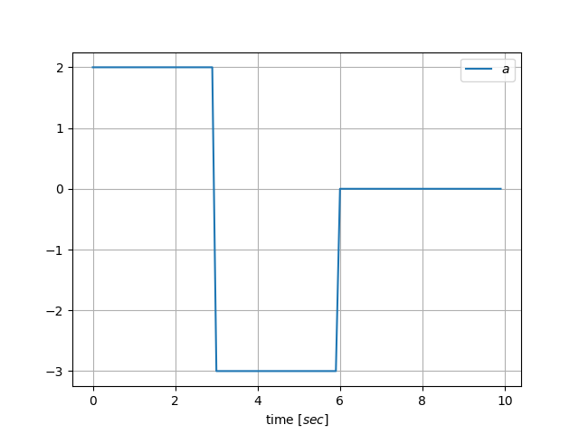
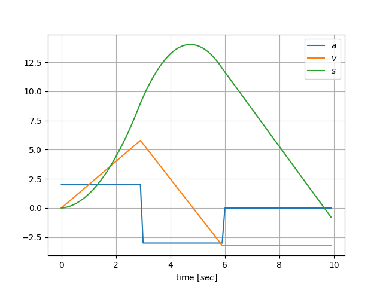
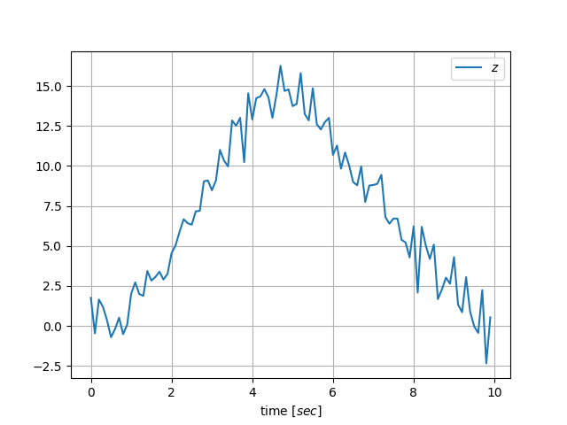
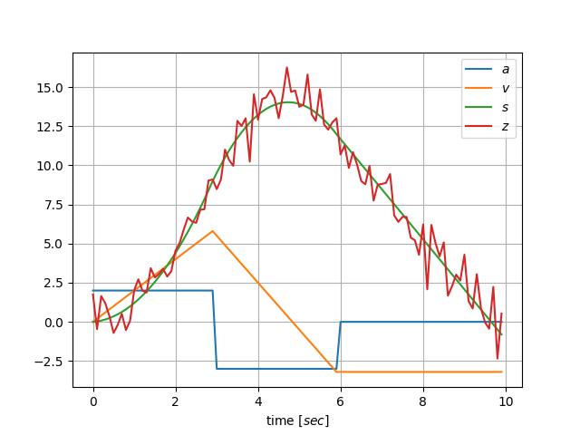
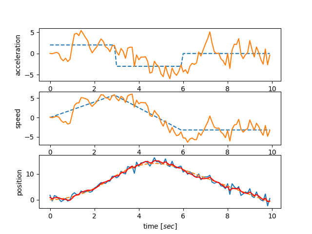
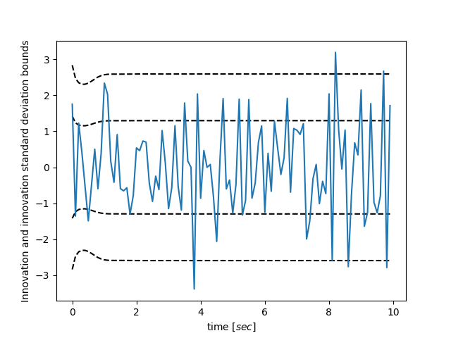
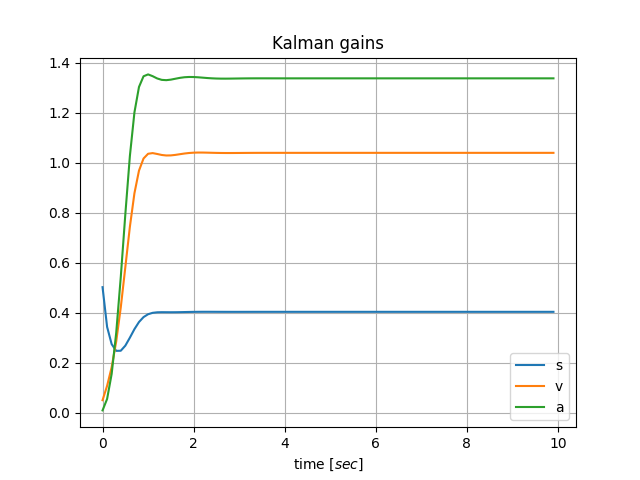
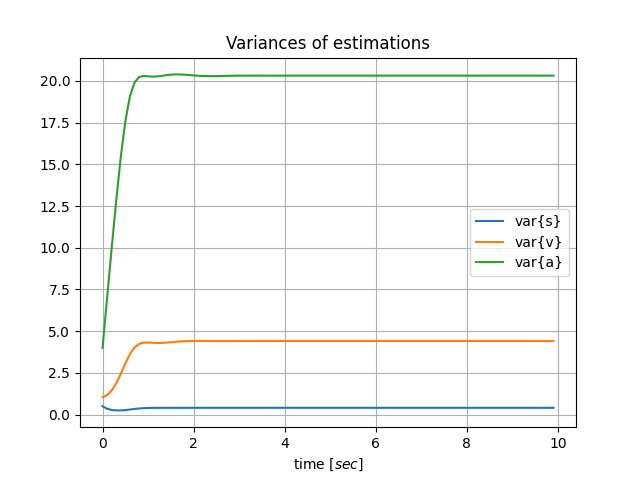

# Basic simulation example of linear discrete Kalman filter, implemented in python.

This is one simple demonstration intended for ones who want to have first touch with Kalman filter, or to see how would the implementation look like in python with numpy.
If you would like to do some basic readings before, you could use a nice lecture [here](http://www.robots.ox.ac.uk/~ian/Teaching/Estimation/LectureNotes2.pdf).
The entire code for the following example is in [kalman.py](kalman.py).
## 
Imagine a point moving in the one dimensional space, so essentially the point is moving at some 1D axis.
Let the acceleration of the point through time be like in the following figure below. 
Integral of the acceleration would give us velocity, and one more integral would give us a position of the point at the 1D axis, which is also shown in the figure next the one mentioned earlier.

<table>
  <tr>
    <td valign="top"></td>
    <td valign="top"></td>
  </tr>
</table>

Now, imagine we were given just the noisy position measurement of the moving point, and our task is to estimate the real position as well as the 
velocity and the acceleration. The position measurement data is given in the file [gps_data.txt](gps_data.txt), and the next two figures represent the measurement alone
and the measurement added to the actual position and it's derivatives.

<table>
  <tr>
    <td valign="top"></td>
    <td valign="top"></td>
  </tr>
</table>

##
I gave you the link for the readings so I won't go to the mathematical and modeling details here. In [kalman.py](kalman.py) you can find the code for generating measurement, 
as well as the code for the model of the Linear Kalman filter, assuming constant acceleration of the target point. The result for the estimated position, acceleration and 
velocity are given in the following figure, as well as the Kalman gains, variances of estimation and the figure that shows innovation compared with it's variance, which is
 a good method too evaluate correctness of your initial modeling assumptions.

<table>
  <tr>
    <td valign="top"></td>
    <td valign="top"></td>
  </tr>
  <tr>
    <td valign="top"></td>
    <td valign="top"></td>
  </tr>
 </table>

 <!--

 -->